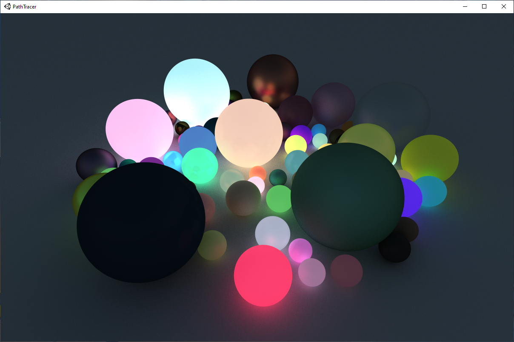
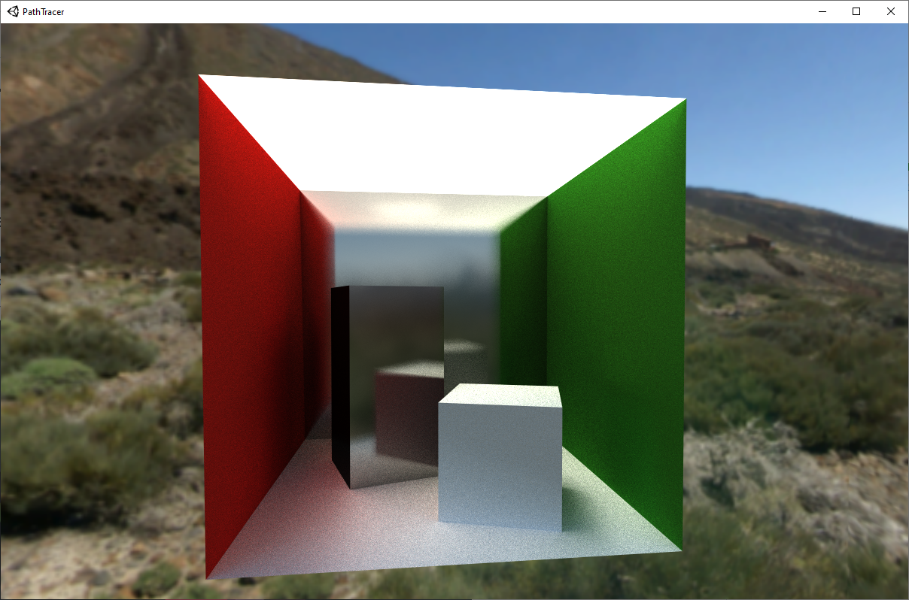

# Path Tracer

My path tracer implemented in Unity engine

------

### Basic Scene
Built based on the tutorial. Only contains a ground and multiple spheres with skybox.  
Compiled executables available [here](https://github.com/teamclouday/PathTracer/releases/tag/tutorial)

### Cornell Box

Compiled executables available [here](https://github.com/teamclouday/PathTracer/releases/tag/cornellbox)

Improved hemisphere sampling adapted from [lwjgl3-demos](https://github.com/LWJGL/lwjgl3-demos/blob/main/res/org/lwjgl/demo/opengl/raytracing/randomCommon.glsl).  
A better random value generator.  
Support unity material `_EMISSION`, `_EmissionColor`, `_Metallic`, `_Glossiness` values.  

------

Reference:

[GPU Ray Tracing in Unity – Part 1](http://blog.three-eyed-games.com/2018/05/03/gpu-ray-tracing-in-unity-part-1/)  
[GPU Path Tracing in Unity – Part 2](http://three-eyed-games.com/2018/05/12/gpu-path-tracing-in-unity-part-2/)  
[GPU Path Tracing in Unity – Part 3](http://three-eyed-games.com/2019/03/18/gpu-path-tracing-in-unity-part-3/)  
[Physically Based Rendering](https://www.pbr-book.org/3ed-2018/contents)