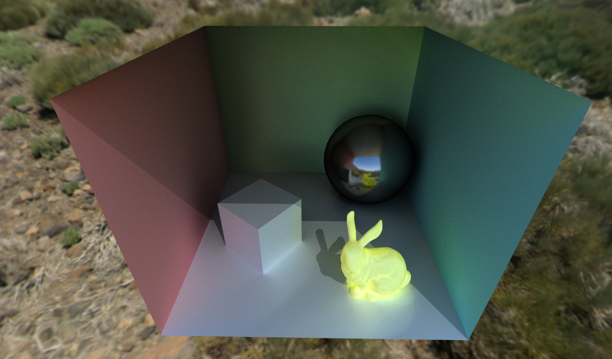
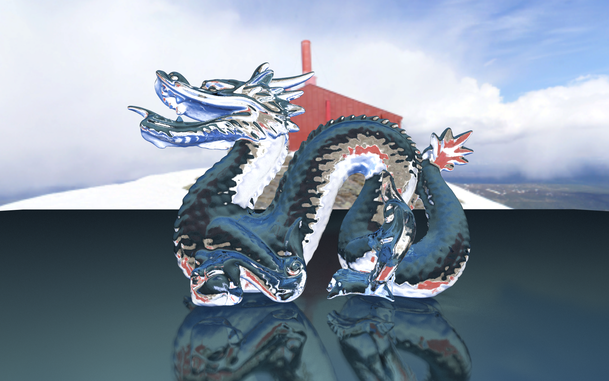
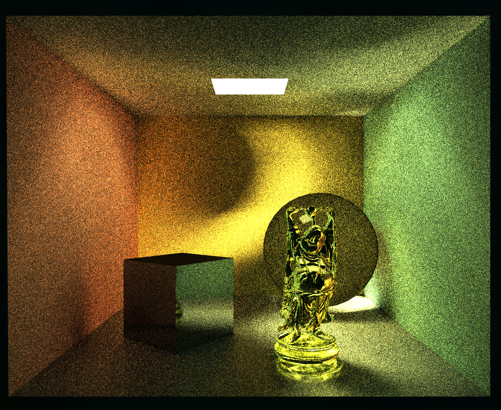
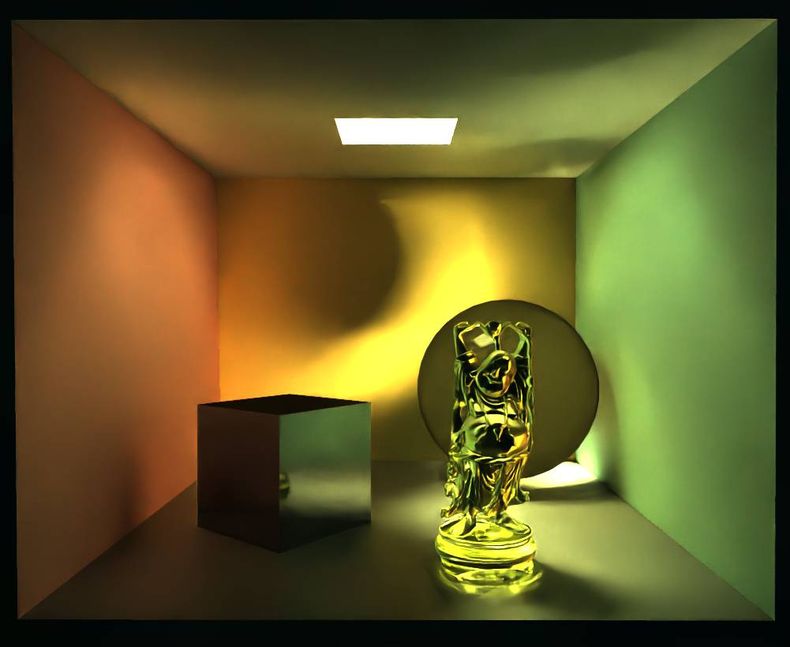

# Path Tracer

My path tracer implemented in Unity engine

------

### Basic Scene
Built based on the tutorial. Only contains a ground and multiple spheres with skybox.  
Compiled executables available [here](https://github.com/teamclouday/PathTracer/releases/tag/tutorial)


### Cornell Box

Compiled executables available [here](https://github.com/teamclouday/PathTracer/releases/tag/cornellbox)

Improved hemisphere sampling adapted from [lwjgl3-demos](https://github.com/LWJGL/lwjgl3-demos/blob/main/res/org/lwjgl/demo/opengl/raytracing/randomCommon.glsl).  
A better random value generator.  
Support unity material `_EMISSION`, `_EmissionColor`, `_Metallic`, `_Glossiness` values.  


### Cornell Box & Bunny

Compiled executables available [here](https://github.com/teamclouday/PathTracer/releases/tag/cornellboxbunny)

Added basic BVH (bounding volume hierarchy).  
Scene Info:
```
BVH tree nodes count = 290135
Total vertices = 100277
Total indices = 435474
Total normals = 100277
Total materials = 10
```
RTX2060S has about 18fps at default view position in unity editor mode  
Looking forward to further optimize it.



### Dragon

Compiled executables available [here](https://github.com/teamclouday/PathTracer/releases/tag/dragon)

Added reflection & refraction workflow for transparent materials.  
In my implementation, if a material (standard shader) render mode is not opaque, it will go through this workflow. In this case, smoothness is translated to index of refraction (`ior`):
```
k => k * 2.0 + 1.0
```
Scene Info:
```
BVH tree nodes count = 1735017
Total vertices = 439077
Total indices = 2614194
Total normals = 439077
Total materials = 3
```
Loading time is very slow. Need to optimize BVH tree construction.



### Cornell Box & Buddha

Compiled executables available [here](https://github.com/teamclouday/PathTracer/releases/tag/cornellboxbuddha)

Added [openimagedenoise](https://github.com/OpenImageDenoise/oidn), so that when the scene cannot converge, the output image is smooth.  
Press Left CTRL + V to toggle denoiser, default is off.

Scene Info:
```
BVH tree nodes count = 2164457
Total vertices = 550046
Total indices = 3265248
Total normals = 550046
Total materials = 10
```
Expect a long loading time.

Without denoiser (412 samples):  


With denoiser (195 samples):  


_Side Note_:  
After multiple testing in this environment setup,
it seems that with a colored skybox (not dark in this case),
the scene converges much faster.
With a dark environment and only one small emissive light object,
the scene converges very slow.
The reason behind it, in my opinion,
is because during random sampling,
the ray hits a dark non-emissive object much more frequently than
hitting an emissive object.
Therefore, the samples contain many dark pixels because the ray is not
lucky enough to reach a light source.
A denoiser is required to improve the visual in this case.

------

### Controls

```
W -> camera forward
S -> camera backward
A -> camera left
D -> camera right
ESC -> quit application
Left click and drag -> camera look around
Scroll up -> move forward
Scroll down -> move backward
Left CTRL + X -> save screenshot in data folder
Left CTRL + V -> toggle denoiser (default is off)
```

------

Reference:

[GPU Ray Tracing in Unity](http://blog.three-eyed-games.com/2018/05/03/gpu-ray-tracing-in-unity-part-1/)  
[Physically Based Rendering](https://www.pbr-book.org/3ed-2018/contents)  
[RadeonRays_SDK](https://github.com/GPUOpen-LibrariesAndSDKs/RadeonRays_SDK)  
[GLSL-PathTracer](https://github.com/knightcrawler25/GLSL-PathTracer)  
[Another View on the Classic Ray-AABB Intersection Algorithm for BVH Traversal](https://medium.com/@bromanz/another-view-on-the-classic-ray-aabb-intersection-algorithm-for-bvh-traversal-41125138b525)  
[Spatial Splits in Bounding Volume Hierarchies](https://www.nvidia.in/docs/IO/77714/sbvh.pdf)  
[Recursive SAH-based Bounding Volume Hierarchy Construction](https://www.gcc.tu-darmstadt.de/media/gcc/papers/rsah_gi2016.pdf)  